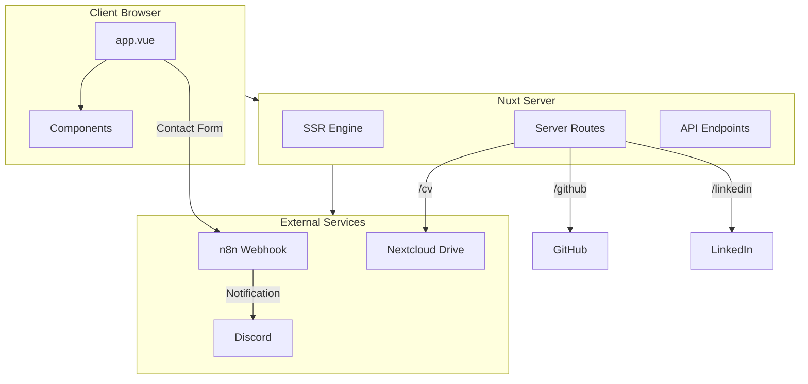
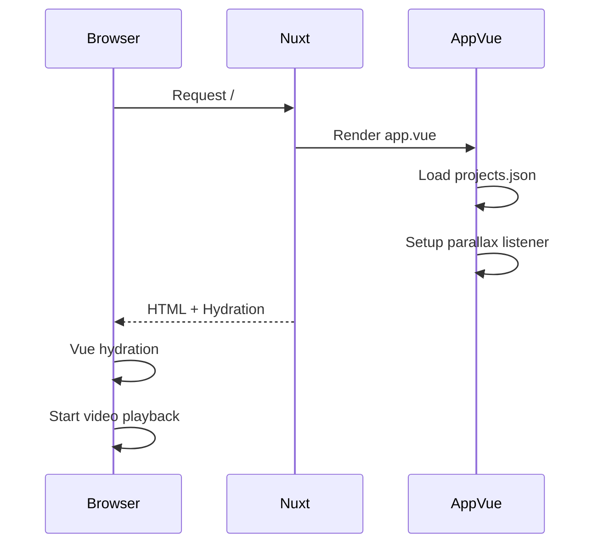
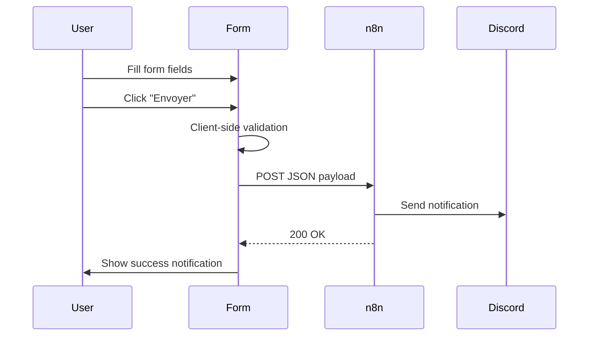
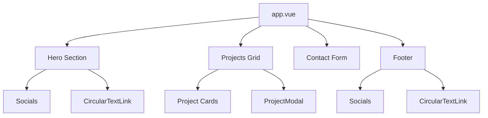

# Architecture

## System Overview



## Application Flow

### Page Load Sequence



### Contact Form Flow



## Component Architecture



## Data Flow

### Projects Data

```
assets/data/projects.json
         │
         ▼
    app.vue (import)
         │
         ▼
    ref(projectsData)
         │
         ▼
    visibleProjects (computed)
    └── Filters: !project.hidden
         │
         ▼
    v-for rendering
         │
         ├── Project Cards (grid)
         │
         └── ProjectModal (on click)
```

### Form Data

```
formData (reactive)
├── firstName: string
├── lastName: string
├── email: string
└── message: string
         │
         ▼
    handleSubmit()
         │
         ▼
    fetch(config.public.formUrl)
         │
         ▼
    n8n webhook
         │
         ▼
    Discord notification
```

## Server Architecture

### Route Handlers

| Route | Method | Handler | Purpose |
|-------|--------|---------|---------|
| `/cv` | GET | `cv.get.ts` | Proxy PDF from Nextcloud |
| `/github` | GET | `github.get.ts` | 302 redirect to GitHub |
| `/linkedin` | GET | `linkedin.get.ts` | 302 redirect to LinkedIn |
| `/mmi` | GET | `mmi.get.ts` | 302 redirect to MMI project |

### Deprecated Endpoints

| Route | Method | Handler | Status |
|-------|--------|---------|--------|
| `/api/contact` | POST | `contact.post.ts` | DEPRECATED - replaced by n8n |

## External Service Integration

### n8n Webhook

- **Purpose**: Receive contact form submissions
- **Trigger**: HTTP POST request
- **Action**: Send Discord notification
- **Configuration**: `FORM_URL` environment variable

```
Client Form
    │
    ▼
POST https://n8n.beauget.fr/webhook/{token}
    │
    ▼
n8n Workflow
    │
    ▼
Discord Webhook → Channel Notification
```

### Nextcloud CV Proxy

- **Purpose**: Serve CV PDF without exposing Nextcloud URL
- **Source**: `https://drive.beauget.fr/s/cv/download`
- **Benefit**: Auto-updates when new CV is uploaded to Nextcloud

```
Client Request: /cv
    │
    ▼
Nuxt Server Route
    │
    ▼
Fetch from Nextcloud
    │
    ▼
Stream PDF to client
Headers: Content-Type: application/pdf
         Content-Disposition: inline; filename="cv.pdf"
```

## State Management

The application uses Vue 3 Composition API with local component state:

| State | Type | Purpose |
|-------|------|---------|
| `projects` | `ref` | Projects array from JSON |
| `visibleProjects` | `computed` | Filtered projects (!hidden) |
| `formData` | `reactive` | Contact form fields |
| `isSubmitting` | `ref` | Form submission state |
| `notification` | `ref` | Toast notification state |
| `parallaxOffset` | `ref` | Video parallax position |
| `selectedProject` | `ref` | Currently opened project |
| `showProjectsModal` | `ref` | Modal visibility |

## Rendering Strategy

- **Mode**: Universal (SSR + Client Hydration)
- **Single Page**: All content in `app.vue`
- **No Router**: Anchor-based navigation (`#home_anchor`, `#projects_anchor`)
