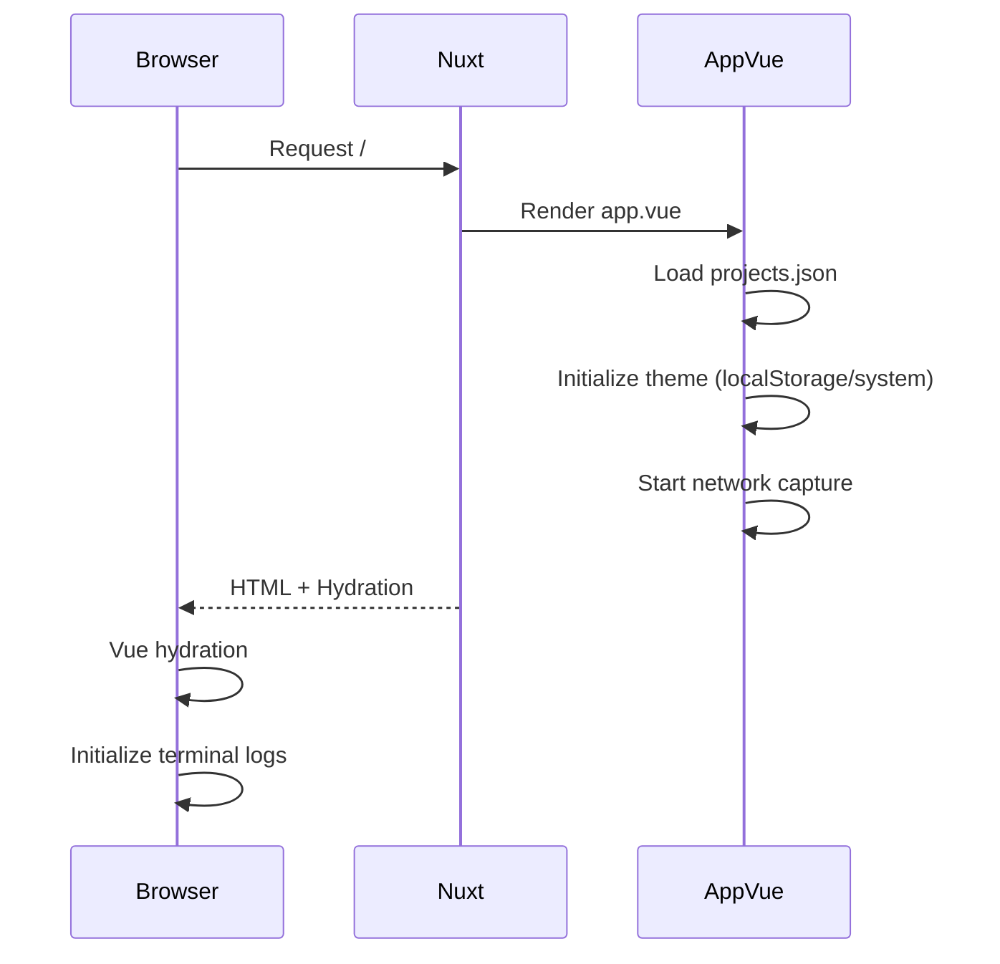
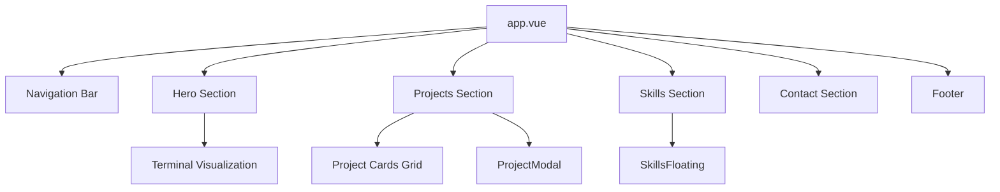

# Architecture

## System Overview


## Application Flow

### Page Load Sequence



### Contact Form Flow


## Component Architecture



## Data Flow

### Projects Data

```text
assets/data/projects.json
         │
         ▼
    app.vue (import)
         │
         ▼
    ref(projectsData)
         │
         ▼
    visibleProjects (computed)
    └── Filters: !project.hidden
         │
         ▼
    v-for rendering
         │
         ├── Project Cards (grid)
         │
         └── ProjectModal (on click)
```

### Form Data

```text
formData (reactive)
├── firstName: string
├── lastName: string
├── email: string
└── message: string
         │
         ▼
    handleSubmit()
         │
         ▼
    fetch(config.public.formUrl)
         │
         ▼
    n8n webhook
         │
         ▼
    Discord notification
```

## Server Architecture

### Route Handlers

| Route     | Method | Handler        | Purpose                          |
|-----------|--------|----------------|----------------------------------|
| `/cv`     | GET    | `cv.get.ts`    | Proxy PDF from Nextcloud         |
| `/github` | GET    | `github.get.ts` | 302 redirect to GitHub           |
| `/linkedin` | GET  | `linkedin.get.ts` | 302 redirect to LinkedIn       |
| `/mmi`    | GET    | `mmi.get.ts`   | 302 redirect to MMI project       |

### Removed Endpoints

| Route          | Method | Handler            | Status                                          |
|----------------|--------|--------------------|-------------------------------------------------|
| `/api/contact` | POST   | `contact.post.ts`  | REMOVED - replaced by direct n8n webhook integration |

## External Service Integration

### n8n Webhook

- **Purpose**: Receive contact form submissions
- **Trigger**: HTTP POST request
- **Action**: Send Discord notification
- **Configuration**: `FORM_URL` environment variable

```text
Client Form
    │
    ▼
POST https://n8n.beauget.fr/webhook/{token}
    │
    ▼
n8n Workflow
    │
    ▼
Discord Webhook → Channel Notification
```

### Nextcloud CV Proxy

- **Purpose**: Serve CV PDF without exposing Nextcloud URL
- **Source**: `https://drive.beauget.fr/s/cv/download`
- **Benefit**: Auto-updates when new CV is uploaded to Nextcloud

```text
Client Request: /cv
    │
    ▼
Nuxt Server Route
    │
    ▼
Fetch from Nextcloud
    │
    ▼
Stream PDF to client
Headers: Content-Type: application/pdf
         Content-Disposition: inline; filename="cv.pdf"
```

## State Management

The application uses Vue 3 Composition API with local component state:

| State                | Type       | Purpose                                                      |
|----------------------|------------|--------------------------------------------------------------|
| `projects`           | `ref`      | Projects array from JSON                                     |
| `visibleProjects`    | `computed` | Filtered projects (!hidden)                                  |
| `selectedProjectIndex` | `ref`    | Index of selected project for modal                          |
| `isModalOpen`        | `computed` | `selectedProjectIndex !== null`                              |
| `formData`           | `reactive` | Contact form fields (firstName, lastName, email, message)    |
| `isSubmitting`       | `ref`      | Form submission state                                        |
| `notification`       | `ref`      | Toast notification state                                     |
| `locale`             | `ref`      | Current language (fr/en)                                     |
| `isDark`             | `ref`      | Dark mode state                                              |
| `terminalLogs`       | `ref`      | Real-time network request logs                               |
| `currentHost`        | `ref`      | Current hostname for terminal display                        |

## Rendering Strategy

- **Mode**: Universal (SSR + Client Hydration)
- **Single Page**: All content in `app.vue`
- **No Router**: Anchor-based navigation (`#home`, `#projects`, `#skills`, `#contact`)
- **Theme**: Dark mode with system preference detection
- **i18n**: French/English language support via Nuxt i18n module
