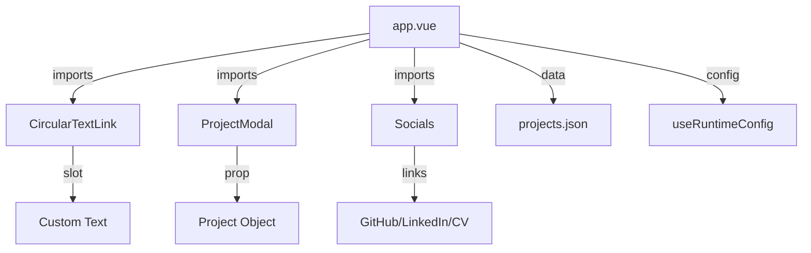

# Components Documentation

## Overview

The application uses three reusable Vue components plus the main `app.vue` which serves as the single-page application container.

```
components/
├── CircularTextLink.vue   # Animated circular navigation link
├── ProjectModal.vue       # Project detail modal overlay
└── Socials.vue            # Social media icon links
```

---

## app.vue

**Location**: `/app.vue`

The main application file containing all page sections. Acts as a single-page application without Vue Router.

### Template Structure

```
<div class="relative">
  ├── Video Background (parallax, masked)
  │
  └── <div class="absolute">
      ├── Hero Section (#home_anchor)
      │   ├── Socials
      │   ├── Name + Title
      │   ├── Bio text
      │   └── CircularTextLink → #projects_anchor
      │
      ├── Projects Section (#projects_anchor)
      │   ├── ProjectModal (conditional)
      │   └── Projects Grid (v-for)
      │
      ├── Contact Section
      │   └── Contact Form
      │
      ├── Footer
      │   ├── Socials
      │   ├── CircularTextLink → #home_anchor
      │   └── Privacy notice + Source link
      │
      └── Notification Toast (Transition)
</div>
```

### State

| Property | Type | Default | Description |
|----------|------|---------|-------------|
| `projects` | `ref<Array>` | `projectsData` | All projects from JSON |
| `visibleProjects` | `computed` | - | Projects where `!hidden` |
| `formData` | `reactive` | `{}` | Contact form fields |
| `isSubmitting` | `ref<boolean>` | `false` | Form submission lock |
| `notification` | `ref<Object>` | `{show, message, type}` | Toast state |
| `parallaxOffset` | `ref<number>` | `0` | Video Y offset |
| `selectedProject` | `ref<Object>` | `null` | Project for modal |
| `showProjectsModal` | `ref<boolean>` | `false` | Modal visibility |

### Methods

| Method | Description |
|--------|-------------|
| `handleSubmit()` | Submit contact form to n8n webhook |
| `autoResize(e)` | Auto-expand textarea on input |
| `handleScroll()` | Update parallax offset on scroll |
| `openProjectsModal(project)` | Open modal with project data |
| `closeProjectsModal()` | Close modal and clear selection |

### Lifecycle

```javascript
onMounted(() => {
  window.addEventListener("scroll", handleScroll);
});

onUnmounted(() => {
  window.removeEventListener("scroll", handleScroll);
});
```

---

## CircularTextLink.vue

**Location**: `/components/CircularTextLink.vue`

Animated circular text navigation link with a directional arrow in the center.

### Visual

```
      ╭──────────────╮
     ╱  Par ici la   ╲
    │    suite •      │
    │       ↓         │
    │   Par ici la    │
     ╲    suite •    ╱
      ╰──────────────╯
```

### Props

| Prop | Type | Required | Default | Description |
|------|------|----------|---------|-------------|
| `link` | `String` | Yes | - | Target href (anchor or URL) |
| `direction` | `String` | No | `"down"` | Arrow direction: `up`, `down`, `left`, `right` |

### Slots

| Slot | Default Content | Description |
|------|-----------------|-------------|
| `default` | `"Click to scroll • Click to scroll •"` | Circular text content |

### Usage Examples

```vue
<!-- Scroll down to projects -->
<CircularTextLink link="#projects_anchor">
  Par ici la suite • Par ici la suite •
</CircularTextLink>

<!-- Scroll up to home -->
<CircularTextLink link="#home_anchor" direction="up">
  Revenir en haut • Accueil • Up •
</CircularTextLink>
```

### Animation

- **Duration**: 20 seconds
- **Direction**: Counter-clockwise (`rotate(-360deg)`)
- **Timing**: Linear, infinite loop

### Implementation Details

- Uses SVG `<textPath>` wrapped around a circular `<path>`
- Arrow paths defined as SVG path data for each direction
- Custom-built component (not from a library)

---

## ProjectModal.vue

**Location**: `/components/ProjectModal.vue`

Full-screen modal overlay displaying project details with image and description.

### Props

| Prop | Type | Required | Default | Description |
|------|------|----------|---------|-------------|
| `project` | `Object` | No | `{}` | Project data object |

### Events

| Event | Payload | Description |
|-------|---------|-------------|
| `close` | - | Emitted when modal should close |

### Close Triggers

1. Click the `✕` button
2. Press `Escape` key
3. Click outside the modal (backdrop)

### Layout

```
┌────────────────────────────────────────────┐
│ (backdrop blur)                            │
│  ┌─────────────────┬──────────────────┐   │
│  │                 │ Project Name   ✕ │   │
│  │                 │                  │   │
│  │   Project       │ Description...   │   │
│  │   Image         │                  │   │
│  │                 │                  │   │
│  │                 │                  │   │
│  ├─────────────────┼──────────────────┤   │
│  │  [Button]       │                  │   │
│  └─────────────────┴──────────────────┘   │
│                                            │
└────────────────────────────────────────────┘
```

### Current Limitations

- Button click shows `window.alert("oui")` (placeholder)
- No gallery support yet (image1-4 fields unused)
- Fixed dimensions: 680x600px image container

### Usage

```vue
<ProjectModal
  v-if="showProjectsModal"
  :project="selectedProject"
  @close="closeProjectsModal"
/>
```

---

## Socials.vue

**Location**: `/components/Socials.vue`

Horizontal list of social media icon links.

### Links

| Icon | Destination | Target |
|------|-------------|--------|
| GitHub | `https://github.com/valentinbgt` | `_blank` |
| LinkedIn | `https://v.beauget.fr/linkedin` (redirect) | `_blank` |
| CV | `/cv` (PDF proxy) | `_blank` |

### Styling

- Responsive sizing: `w-10` (mobile) → `w-14` (desktop)
- Hover effect: Drop shadow (defined in `app.vue`)
- Active effect: `translateY(3px)` with shadow removed

### CSS Classes (from app.vue)

```css
.social-icon:hover {
  filter: drop-shadow(0px 3px 0px white);
}

.social-icon:active {
  transform: translateY(3px);
  filter: drop-shadow(0px 0px 0px white);
}
```

### Usage

```vue
<!-- In header -->
<div class="w-screen flex flex-row-reverse">
  <Socials />
</div>

<!-- In footer -->
<div class="flex flex-col items-center">
  <Socials />
</div>
```

---

## Component Dependency Graph


