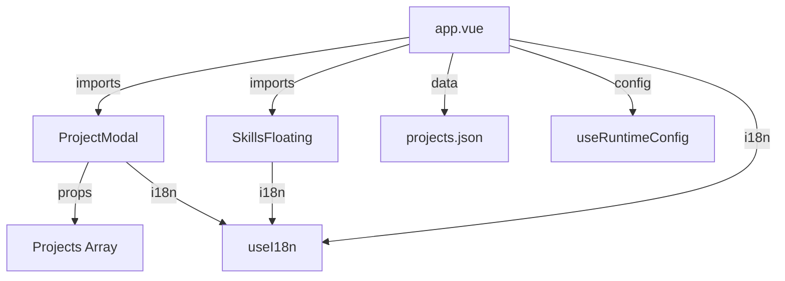

# Components Documentation

## Overview

The application uses two reusable Vue components plus the main `app.vue` which serves as the single-page application container.

```text
components/
├── ProjectModal.vue       # Project detail modal with image gallery
└── SkillsFloating.vue     # Interactive floating skills visualization
```

---

## app.vue

**Location**: `/app.vue`

The main application file containing all page sections. Acts as a single-page application without Vue Router.

### Template Structure

```text
<div class="min-h-screen">
  ├── Navigation Bar (fixed top)
  │   ├── Logo
  │   ├── Navigation links
  │   └── Theme/Language toggles
  │
  ├── Hero Section (#home)
  │   ├── Title + Subtitle
  │   ├── Description
  │   ├── CTA buttons
  │   └── Terminal visualization (real-time network logs)
  │
  ├── Projects Section (#projects)
  │   ├── Admin panel UI
  │   ├── Projects Grid
  │   └── ProjectModal (conditional, carousel)
  │
  ├── Skills Section (#skills)
  │   └── SkillsFloating (interactive canvas)
  │
  ├── Contact Section (#contact)
  │   └── Contact Form (n8n webhook)
  │
  ├── Footer
  │   ├── Copyright
  │   └── Social links (GitHub, LinkedIn, Source)
  │
  └── Notification Toast (Transition)
</div>
```

### State

| Property              | Type       | Default            | Description                           |
|-----------------------|------------|--------------------|---------------------------------------|
| `projects`            | `ref<Array>` | `projectsData`     | All projects from JSON                 |
| `visibleProjects`     | `computed`  | -                  | Projects where `!hidden`              |
| `selectedProjectIndex` | `ref<number>` | `null`           | Index of selected project for modal   |
| `isModalOpen`         | `computed`  | -                  | `selectedProjectIndex !== null`       |
| `formData`            | `reactive`  | `{}`               | Contact form fields                   |
| `isSubmitting`        | `ref<boolean>` | `false`          | Form submission lock                  |
| `notification`        | `ref<Object>` | `{show, message, type}` | Toast state                    |
| `locale`              | `ref<string>` | `"fr"`           | Current language (fr/en)              |
| `isDark`              | `ref<boolean>` | `false`         | Dark mode state                       |
| `terminalLogs`        | `ref<Array>` | `[]`             | Real-time network request logs         |
| `currentHost`         | `ref<string>` | `""`            | Current hostname for terminal         |

### Methods

| Method                  | Description                              |
|-------------------------|------------------------------------------|
| `handleSubmit()`        | Submit contact form to n8n webhook      |
| `toggleLocale()`        | Switch between French and English        |
| `toggleTheme()`         | Toggle dark/light mode                   |
| `openProject(project)`  | Open modal with project (finds index)    |
| `closeProject()`        | Close modal and restore body scroll      |
| `updateProjectIndex(index)` | Update selected project index (carousel) |
| `startNetworkCapture()` | Begin capturing real network requests   |
| `stopNetworkCapture()`  | Stop network request capture             |
| `addLog(log)`           | Add network log entry to terminal        |

### Lifecycle

```javascript
onMounted(() => {
  // Initialize theme from localStorage or system preference
  if (localStorage.getItem("theme") === "dark" || 
      (!localStorage.getItem("theme") && 
       window.matchMedia("(prefers-color-scheme: dark)").matches)) {
    isDark.value = true;
    document.documentElement.classList.add("dark");
  }
  
  // Start capturing real network requests for terminal
  startNetworkCapture();
  currentHost.value = window.location.host;
});

onUnmounted(() => {
  stopNetworkCapture();
});
```

---

## ProjectModal.vue

**Location**: `/components/ProjectModal.vue`

Full-screen modal overlay displaying project details with image gallery, carousel navigation, and lightbox. Supports i18n for all text content.

### Props

| Prop          | Type     | Required | Default | Description                      |
|---------------|----------|----------|---------|----------------------------------|
| `projects`    | `Array`  | Yes      | `[]`    | Array of all visible projects    |
| `initialIndex` | `Number` | No       | `0`     | Initial project index to display |
| `locale`      | `String` | Yes      | `"fr"`  | Current locale (fr/en)           |

### Events

| Event          | Payload  | Description                              |
|----------------|----------|------------------------------------------|
| `close`       | -        | Emitted when modal should close          |
| `update:index` | `number` | Emitted when navigating to different project |

### Features

- **Image Gallery**: Displays up to 4 images in responsive grid layout
- **Carousel Navigation**: Navigate between projects with prev/next buttons
- **Lightbox**: Click images to view full-size in lightbox with navigation
- **i18n Support**: All text content adapts to current locale
- **Keyboard Support**: Escape to close, arrow keys for navigation

### Layout

```text
┌────────────────────────────────────────────┐
│ (backdrop blur)                            │
│  ┌──────────────────────────────────────┐ │
│  │ Project Name | Category        [✕]  │ │
│  │ ID • Year                          │ │
│  ├──────────────────────────────────────┤ │
│  │ [Image Gallery Grid (1-4 images)]   │ │
│  ├──────────────────────────────────────┤ │
│  │ About the project                   │ │
│  │ Description text...                 │ │
│  │                                     │ │
│  │ Key Points:                        │ │
│  │ • Feature 1                        │ │
│  │ • Feature 2                        │ │
│  │                                     │ │
│  │ [Links] [Stack] [Status]           │ │
│  └──────────────────────────────────────┘ │
│  [← Prev]              [Next →]          │
└────────────────────────────────────────────┘
```

### Image Gallery Layouts

- **1 image**: Full width
- **2 images**: 2 columns
- **3 images**: Large left (2 rows) + 2 small right
- **4 images**: Large left (2 rows) + 3 small right

### Usage

```vue
<ProjectModal
  v-if="isModalOpen"
  :projects="visibleProjects"
  :initial-index="selectedProjectIndex"
  :locale="locale"
  @close="closeProject"
  @update:index="updateProjectIndex"
/>
```

---

## SkillsFloating.vue

**Location**: `/components/SkillsFloating.vue`

Interactive floating skills visualization using Canvas API with physics-based animations. Skills float and react to mouse movement.

### Features

- **Physics Simulation**: Skills move with velocity, friction, and collision detection
- **Mouse Interaction**: Skills are repelled by mouse cursor
- **Responsive**: Adapts to container size
- **i18n Support**: Skill names adapt to current locale

### Props

None (uses `useI18n()` composable internally)

### Skills Displayed

Skills are defined internally and include:

- Frontend: Vue.js, TypeScript, Tailwind CSS, React
- Backend: Node.js, Express, PostgreSQL, Docker, Linux, Git
- Infrastructure: Various DevOps tools

### Implementation

- Uses GSAP for animations
- Canvas-based rendering for performance
- Collision detection between skill elements
- Mouse repulsion physics

---

## Component Dependency Graph


