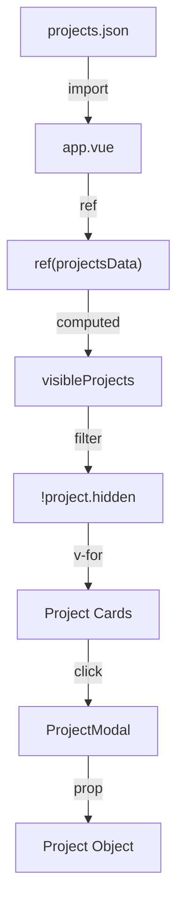

# Data Structures Documentation

## Overview

The application uses a JSON file to store project data. This document describes the schema and how to manage project entries.

---

## Projects Data

**Location**: `assets/data/projects.json`

### Schema

```typescript
interface Project {
  disabled: boolean;    // Button interactivity
  hidden: boolean;      // Visibility in grid
  name: string;         // Project title
  description: string;  // Short description
  button: string;       // Button text
  image: string;        // Filename in /public/images/
  lien: string;         // External URL
  image1: string;       // Reserved for gallery (unused)
  image2: string;       // Reserved for gallery (unused)
  image3: string;       // Reserved for gallery (unused)
  image4: string;       // Reserved for gallery (unused)
}

type ProjectsData = Project[];
```

### Field Descriptions

| Field | Type | Required | Description |
|-------|------|----------|-------------|
| `disabled` | `boolean` | Yes | If `true`, button is grayed out and non-clickable |
| `hidden` | `boolean` | Yes | If `true`, project is not rendered in the grid |
| `name` | `string` | Yes | Display name shown on card and modal |
| `description` | `string` | Yes | Short description (truncated on card, full in modal) |
| `button` | `string` | Yes | Call-to-action text on the button |
| `image` | `string` | Yes | Filename of image in `/public/images/` |
| `lien` | `string` | Yes | Destination URL when action is clicked |
| `image1-4` | `string` | No | Reserved for future gallery feature |

### State Matrix

| `disabled` | `hidden` | Result |
|------------|----------|--------|
| `false` | `false` | Visible, clickable |
| `true` | `false` | Visible, grayed out button |
| `false` | `true` | Not rendered |
| `true` | `true` | Not rendered |

---

## Current Projects

```json
[
  {
    "disabled": false,
    "hidden": true,
    "name": "BledMarket",
    "description": "Un moyen de stocker ses fichier sur Internet et les partager p...",
    "button": "Cliquez ici c'est super !",
    "image": "bledmarket.png",
    "lien": "https://bledmarket.fr/"
  },
  {
    "disabled": false,
    "hidden": false,
    "name": "Présidence BDE MMI",
    "description": "J'ai fondé le Bureau Des Étudiants en Métiers du Multimédia et de l'Internet à Troyes en 2024.",
    "button": "Site web de l'association",
    "image": "bde.png",
    "lien": "https://bde.mmi-troyes.fr/"
  },
  {
    "disabled": false,
    "hidden": false,
    "name": "Organisation Nuit Campus 3",
    "description": "Responsable de la House Stage lors de la Nuit Campus 3 2025",
    "button": "Site web du festival",
    "image": "nc3.jpg",
    "lien": "https://nc3.campus3.fr/"
  },
  {
    "disabled": true,
    "hidden": false,
    "name": "Serveur Auto Hébergé",
    "description": "Un serveur sous Debian 12 CLI, redondance des données (RA...",
    "button": "Rien à visualiser pour ce projet..",
    "image": "serveur.png",
    "lien": "https://google.fr/"
  },
  {
    "disabled": false,
    "hidden": false,
    "name": "La SAÉ 105",
    "description": "Un projet réalisé dans le cadre de mes études en Bachelor Un...",
    "button": "Je suis un super projet !",
    "image": "sae105.png",
    "lien": "https://mmi23a02.sae105.ovh/"
  },
  {
    "disabled": false,
    "hidden": false,
    "name": "Results",
    "description": "Un projet pour visualiser les différences dans les résultats éle...",
    "button": "Venez en voir plus !",
    "image": "results.png",
    "lien": "https://results.beauget.fr/"
  }
]
```

### Project Status Summary

| Project | Visible | Interactive |
|---------|---------|-------------|
| BledMarket | No (WIP) | Yes |
| Présidence BDE MMI | Yes | Yes |
| Organisation Nuit Campus 3 | Yes | Yes |
| Serveur Auto Hébergé | Yes | No (disabled) |
| La SAÉ 105 | Yes | Yes |
| Results | Yes | Yes |

---

## Adding a New Project

### Step 1: Add Image

Place project image in `/public/images/`:
- Recommended size: 800x600px or similar aspect ratio
- Formats: PNG, JPG, WebP
- Name without spaces: `my-project.png`

### Step 2: Add JSON Entry

Add to `assets/data/projects.json`:

```json
{
  "disabled": false,
  "hidden": false,
  "name": "My New Project",
  "description": "A brief description of the project that explains what it does.",
  "button": "View Project",
  "image": "my-project.png",
  "lien": "https://example.com/",
  "image1": "",
  "image2": "",
  "image3": "",
  "image4": ""
}
```

### Step 3: Rebuild

```bash
npm run build
```

---

## Data Flow



---

## Filtering Logic

### In app.vue

```javascript
const projects = ref(projectsData);

const visibleProjects = computed(() => {
  return projects.value.filter((project) => !project.hidden);
});
```

### Returned to Template

```javascript
return {
  projects: visibleProjects,  // Note: returns computed, not raw ref
  // ...
};
```

---

## Future: Gallery Feature

The `image1-4` fields are reserved for a future gallery feature in the modal:

```typescript
// Planned structure
interface ProjectWithGallery extends Project {
  image1: string;  // Gallery image 1
  image2: string;  // Gallery image 2
  image3: string;  // Gallery image 3
  image4: string;  // Gallery image 4
}
```

**Planned Usage**:
- Display multiple images in ProjectModal
- Image carousel or grid in modal
- Currently empty strings in all projects

---

## Form Data Structure

### Contact Form (reactive object)

```typescript
interface FormData {
  firstName: string;
  lastName: string;
  email: string;
  message: string;
}
```

### Submitted to n8n

```json
{
  "firstName": "John",
  "lastName": "Doe",
  "email": "john@example.com",
  "message": "Hello, I'd like to get in touch..."
}
```

---

## Notification State

```typescript
interface Notification {
  show: boolean;
  message: string;
  type: "success" | "error";
}
```

### States

| Event | show | message | type |
|-------|------|---------|------|
| Initial | `false` | `""` | `"success"` |
| Success | `true` | `"Message envoyé avec succès !"` | `"success"` |
| Error | `true` | `"Une erreur est survenue..."` | `"error"` |
| After 10s | `false` | (previous) | (previous) |

---

## Image Assets

### Location

All project images are stored in `/public/images/`

### Current Images

| Filename | Project |
|----------|---------|
| `bde.png` | Présidence BDE MMI |
| `bledmarket.png` | BledMarket (hidden) |
| `nc3.jpg` | Organisation Nuit Campus 3 |
| `serveur.png` | Serveur Auto Hébergé |
| `sae105.png` | La SAÉ 105 |
| `results.png` | Results |
| `lorem1.png` | Placeholder (hidden) |
| `lorem2.png` | Placeholder (hidden) |
| `image.png` | Unused |

### Image Reference in Components

```vue
<!-- In app.vue (project card) -->


<!-- In ProjectModal.vue -->
<div :style="`background-image: url(/images/${project?.image ?? ''})`"></div>
```
