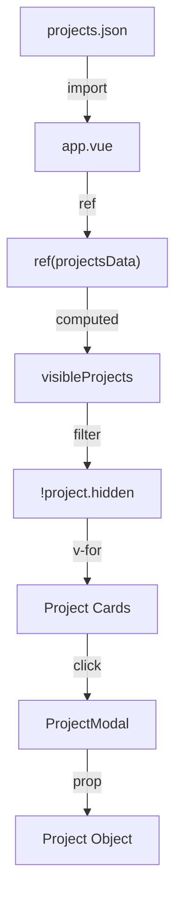

# Data Structures Documentation

## Overview

The application uses a JSON file to store project data. This document describes the schema and how to manage project entries.

---

## Projects Data

**Location**: `assets/data/projects.json`

### Schema

```typescript
interface Project {
  id: string;                                    // Unique project identifier
  hidden: boolean;                                // Visibility in grid
  title: { fr: string; en: string };             // Project title (i18n)
  shortDesc: { fr: string; en: string };         // Short description for cards (i18n)
  description: { fr: string; en: string };      // Full description for modal (i18n)
  images: string[];                              // Array of image paths (gallery)
  stack: { fr: string[]; en: string[] };         // Technologies used (i18n)
  status: { fr: string; en: string };            // Project status (i18n)
  category: { fr: string; en: string };          // Project category (i18n)
  year: string;                                  // Year or date range
  links: Array<{                                 // External links
    label: { fr: string; en: string };           // Link label (i18n)
    url: string;                                  // Link URL
  }>;
  features: { fr: string[]; en: string[] };      // Key features/points (i18n)
}

type ProjectsData = Project[];
```

### Field Descriptions

| Field        | Type                        | Required | Description                                    |
|--------------|-----------------------------|----------|------------------------------------------------|
| `id`         | `string`                    | Yes      | Unique identifier (e.g., `"#BDE-MMI-TROYES"`)  |
| `hidden`     | `boolean`                   | Yes      | If `true`, project is not rendered in the grid |
| `title`      | `{fr: string, en: string}`  | Yes      | Project title in both languages                |
| `shortDesc`  | `{fr: string, en: string}`  | Yes      | Short description shown on project card        |
| `description` | `{fr: string, en: string}` | Yes      | Full description shown in modal                |
| `images`     | `string[]`                  | Yes      | Array of image paths (e.g., `["/images/bde.png"]`) |
| `stack`      | `{fr: string[], en: string[]}` | Yes   | Technologies/tools used                        |
| `status`     | `{fr: string, en: string}`  | Yes      | Project status (e.g., "Terminé" / "Completed") |
| `category`   | `{fr: string, en: string}` | Yes      | Project category (e.g., "Associatif" / "Non-profit") |
| `year`       | `string`                    | Yes      | Year or date range (e.g., `"2024-2025"`)      |
| `links`      | `Array<{label, url}>`       | Yes      | External links with i18n labels                |
| `features`   | `{fr: string[], en: string[]}` | Yes   | Key features or highlights                      |

### Visibility Logic

| `hidden` | Result                                    |
|---------|-------------------------------------------|
| `false` | Visible in grid, clickable to open modal  |
| `true`  | Not rendered in grid (hidden projects)    |

---

## Current Projects Example

```json
[
  {
    "id": "#BDE-MMI-TROYES",
    "hidden": false,
    "title": {
      "fr": "Présidence du BDE MMI Troyes",
      "en": "MMI Troyes Student Union Presidency"
    },
    "shortDesc": {
      "fr": "Fondateur du Bureau Des Étudiants de ma formation.",
      "en": "Founder of the Student Union of my program."
    },
    "description": {
      "fr": "En Juin 2024, j'ai fondé le Bureau Des Étudiants...",
      "en": "In June 2024, I founded the Student Union..."
    },
    "images": ["/images/bde.png", "/images/nds.jpg", "/images/pull_bde_2025.jpg"],
    "stack": {
      "fr": ["Organisation", "Vision", "Autonomie"],
      "en": ["Organization", "Vision", "Autonomy"]
    },
    "status": {
      "fr": "Terminé",
      "en": "Completed"
    },
    "category": {
      "fr": "Associatif",
      "en": "Non-profit"
    },
    "year": "2024-2025",
    "links": [
      {
        "label": { "fr": "Instagram", "en": "Instagram" },
        "url": "https://www.instagram.com/bde.mmi.troyes/"
      },
      {
        "label": { "fr": "Site web", "en": "Website" },
        "url": "https://bde.mmi-troyes.fr/"
      }
    ],
    "features": {
      "fr": ["Création de structure", "Vision et stratégie", "Organisation d'événements"],
      "en": ["Structure creation", "Vision and strategy", "Event organization"]
    }
  }
]
```

### Project Status Summary

| Project ID       | Visible      | Images Count |
|------------------|--------------|--------------|
| #BDE-MMI-TROYES  | Yes          | 3            |
| #NC3-2025        | Yes          | 4            |
| #SERVER1         | Yes          | 3            |
| #WS105           | Yes          | 3            |
| #WS-303          | Yes          | 3            |
| #SECRET          | No (hidden)  | 1            |

---

## Adding a New Project

### Step 1: Add Images

Place project images in `/public/images/`:

- Recommended size: 1200x800px or similar aspect ratio
- Formats: PNG, JPG, JPEG, WebP
- Name without spaces: `my-project-1.png`, `my-project-2.png`, etc.
- You can add multiple images for the gallery (up to 4 displayed in modal)

### Step 2: Add JSON Entry

Add to `assets/data/projects.json`:

```json
{
  "id": "#MY-PROJECT",
  "hidden": false,
  "title": {
    "fr": "Mon Nouveau Projet",
    "en": "My New Project"
  },
  "shortDesc": {
    "fr": "Une brève description du projet.",
    "en": "A brief description of the project."
  },
  "description": {
    "fr": "Description complète du projet avec détails...",
    "en": "Full project description with details..."
  },
  "images": [
    "/images/my-project-1.png",
    "/images/my-project-2.png"
  ],
  "stack": {
    "fr": ["Vue.js", "TypeScript", "Tailwind CSS"],
    "en": ["Vue.js", "TypeScript", "Tailwind CSS"]
  },
  "status": {
    "fr": "En cours",
    "en": "In Progress"
  },
  "category": {
    "fr": "Site web",
    "en": "Website"
  },
  "year": "2025",
  "links": [
    {
      "label": { "fr": "Site web", "en": "Website" },
      "url": "https://example.com/"
    },
    {
      "label": { "fr": "Code source", "en": "Source code" },
      "url": "https://github.com/user/repo"
    }
  ],
  "features": {
    "fr": ["Feature 1", "Feature 2", "Feature 3"],
    "en": ["Feature 1", "Feature 2", "Feature 3"]
  }
}
```

### Step 3: Rebuild

```bash
npm run build
```

---

## Data Flow



---

## Filtering Logic

### In app.vue

```javascript
const projects = ref(projectsData);

const visibleProjects = computed(() => {
  return projects.value.filter((project) => !project.hidden);
});
```

### Returned to Template

```javascript
return {
  projects: visibleProjects,  // Note: returns computed, not raw ref
  // ...
};
```

---

## Image Gallery

The `images` array supports multiple images per project. The modal displays up to 4 images in a responsive grid layout:

- **1 image**: Full width display
- **2 images**: 2-column grid
- **3 images**: Large image on left (2 rows) + 2 small images on right
- **4+ images**: Large image on left (2 rows) + 3 small images on right (first 4 shown)

All images are clickable to open in a lightbox with navigation between images.

---

## Form Data Structure

### Contact Form (reactive object)

```typescript
interface FormData {
  firstName: string;
  lastName: string;
  email: string;
  message: string;
}
```

### Submitted to n8n

```json
{
  "firstName": "John",
  "lastName": "Doe",
  "email": "john@example.com",
  "message": "Hello, I'd like to get in touch..."
}
```

---

## Notification State

```typescript
interface Notification {
  show: boolean;
  message: string;
  type: "success" | "error";
}
```

### States

| Event      | show    | message                              | type      |
|------------|---------|--------------------------------------|-----------|
| Initial    | `false` | `""`                                 | `"success"` |
| Success    | `true`  | `"Message envoyé avec succès !"`     | `"success"` |
| Error      | `true`  | `"Une erreur est survenue..."`       | `"error"`   |
| After 10s  | `false` | (previous)                           | (previous) |

---

## Image Assets

### Location

All project images are stored in `/public/images/`

### Current Images

| Filename        | Project                    |
|----------------|----------------------------|
| `bde.png`      | Présidence BDE MMI          |
| `bledmarket.png` | BledMarket (hidden)        |
| `nc3.jpg`      | Organisation Nuit Campus 3  |
| `serveur.png`  | Serveur Auto Hébergé        |
| `sae105.png`   | La SAÉ 105                 |
| `results.png`  | Results                    |
| `lorem1.png` | Placeholder (hidden) |
| `lorem2.png` | Placeholder (hidden) |
| `image.png` | Unused |

### Image Reference in Components

```vue
<!-- In app.vue (project card) -->


<!-- In ProjectModal.vue (gallery) -->
<div v-for="(img, idx) in project.images.slice(0, 4)" :key="idx">
  
</div>
```
