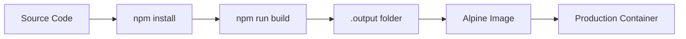
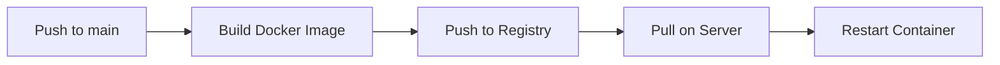

# Deployment Documentation

## Overview

The project is deployed as a Docker container on a self-hosted server, behind a reverse proxy.

---

## Local Development

### Prerequisites

- Node.js (latest LTS recommended)
- npm

### Setup

```bash
# Clone repository
git clone https://github.com/valentinbgt/v.beauget.fr.git
cd v.beauget.fr

# Install dependencies
npm install

# Create environment file
cp .env.example .env
# Edit .env and set FORM_URL

# Start development server
npm run dev
```

**Development URL**: `http://localhost:3000`

### Available Scripts

| Script       | Command         | Description                              |
|--------------|-----------------|------------------------------------------|
| `dev`        | `nuxt dev`      | Development server with HMR              |
| `build`      | `nuxt build`    | Production build                         |
| `generate`   | `nuxt generate` | Static site generation                   |
| `preview`    | `nuxt preview`  | Preview production build                 |
| `postinstall` | `nuxt prepare` | Prepare Nuxt (auto-runs after install)  |

---

## Environment Configuration

### Required Variables

| Variable   | Description      | Example                                    |
|------------|------------------|--------------------------------------------|
| `FORM_URL` | n8n webhook URL   | `https://n8n.beauget.fr/webhook/abc123`    |

### .env.example

```env
FORM_URL=https://n8n.beauget.fr/webhook/WEBHOOK_TOKEN
```

### Nuxt Runtime Config

The environment variable is exposed via Nuxt's runtime config:

```typescript
// nuxt.config.ts
runtimeConfig: {
  public: {
    formUrl: "",  // Populated by NUXT_PUBLIC_FORM_URL or FORM_URL
  },
},
```

**Note**: Nuxt automatically maps `NUXT_PUBLIC_FORM_URL` to `runtimeConfig.public.formUrl`. The simpler `FORM_URL` also works.

---

## Docker Deployment

### Dockerfile

**Location**: `.ci-cd/Dockerfile`

```dockerfile
# Stage 1: Build
FROM node:latest AS builder

WORKDIR /app

ARG CACHEBUST
COPY . .

RUN npm install
RUN npm run build

# Stage 2: Production
FROM node:alpine

WORKDIR /app

COPY --from=builder /app/.output /app

EXPOSE 3000

CMD ["node", "/app/server/index.mjs"]
```

### Build Process



### Build Commands

```bash
# Build Docker image
docker build -t v-beauget-fr -f .ci-cd/Dockerfile .

# Run container
docker run -d \
  --restart always \
  --name v-beauget-fr \
  -p 3000:3000 \
  -e FORM_URL="https://n8n.beauget.fr/webhook/YOUR_TOKEN" \
  v-beauget-fr:latest
```

### With Volume Mount (for messages.json - if using deprecated API)

```bash
docker run -d \
  --restart always \
  --name v-beauget-fr \
  -v /var/www/v-beauget-fr/data:/app/server/data \
  -p 3000:3000 \
  -e FORM_URL="https://n8n.beauget.fr/webhook/YOUR_TOKEN" \
  v-beauget-fr:latest
```

---

## Production Architecture

```text
Internet
    │
    ▼
┌─────────────────┐
│ Reverse Proxy   │
│ (Nginx/Traefik) │
│ :443 (HTTPS)    │
└────────┬────────┘
         │
         ▼
┌─────────────────┐
│ Docker Container│
│ Node.js         │
│ :3000           │
└─────────────────┘
```

### Reverse Proxy Configuration (Nginx Example)

```nginx
server {
    listen 443 ssl http2;
    server_name v.beauget.fr;

    ssl_certificate /path/to/cert.pem;
    ssl_certificate_key /path/to/key.pem;

    location / {
        proxy_pass http://localhost:3000;
        proxy_http_version 1.1;
        proxy_set_header Upgrade $http_upgrade;
        proxy_set_header Connection 'upgrade';
        proxy_set_header Host $host;
        proxy_set_header X-Real-IP $remote_addr;
        proxy_set_header X-Forwarded-For $proxy_add_x_forwarded_for;
        proxy_set_header X-Forwarded-Proto $scheme;
        proxy_cache_bypass $http_upgrade;
    }
}
```

---

## CI/CD

### Current State

- No automated CI/CD pipelines configured
- Manual Docker builds and deployments
- No GitHub Actions or GitLab CI files present

### Recommended Workflow



### Cache Busting

The Dockerfile includes a `CACHEBUST` argument for forcing rebuilds:

```bash
docker build --build-arg CACHEBUST=$(date +%s) -t v-beauget-fr .
```

---

## Production Checklist

### Before Deployment

- [ ] Set `FORM_URL` environment variable
- [ ] Verify n8n webhook is active
- [ ] Check Nextcloud CV share link is valid
- [ ] Test contact form submission
- [ ] Verify all redirect routes work

### Container Health

```bash
# Check container status
docker ps -a | grep v-beauget-fr

# View logs
docker logs v-beauget-fr

# Restart container
docker restart v-beauget-fr

# Stop and remove
docker stop v-beauget-fr && docker rm v-beauget-fr
```

---

## File Outputs

After `npm run build`, the output is in `.output/`:

```
.output/
├── server/
│   ├── index.mjs        # Server entry point
│   └── chunks/          # Server chunks
├── public/
│   ├── _nuxt/           # Client assets
│   └── ...              # Static files
└── nitro.json           # Nitro config
```

---

## Ports

| Port | Service      | Environment              |
|------|--------------|--------------------------|
| 3000 | Nuxt Server  | Development & Production  |
| 443  | HTTPS (via proxy) | Production          |

---

## Troubleshooting

### Common Issues

**Container won't start**:
```bash
docker logs v-beauget-fr
# Check for missing environment variables or build errors
```

**Contact form not working**:

- Verify `FORM_URL` is set correctly
- Check n8n webhook is active
- Test webhook URL directly with curl

**CV download fails**:

- Check Nextcloud share link is valid
- Verify `https://drive.beauget.fr/s/cv/download` is accessible

**Theme not working**:

- Check browser localStorage for theme preference
- Verify dark mode classes are applied correctly
- Check system preference detection
